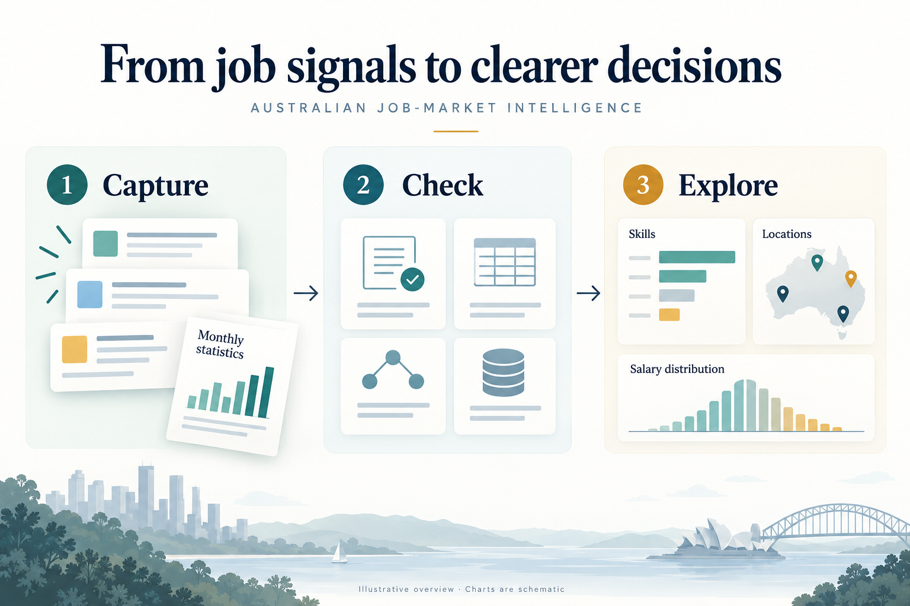
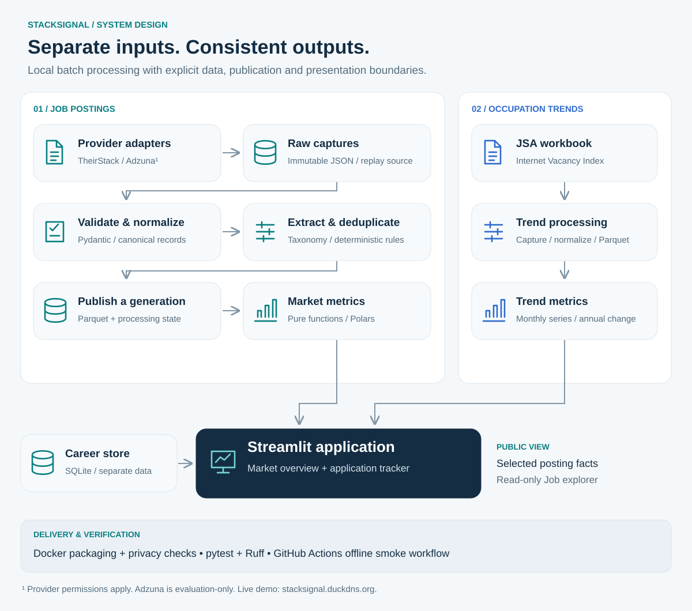

# StackSignal

### See the market. Focus your next move.

Explore employer skill demand, observed opportunities and advertised salaries—with explicit sample limits and reproducible data processing.

[**Explore the live demo →**](https://stacksignal.duckdns.org) · [Engineering decisions](#engineering-decisions) · [Verification and recovery](#verification-and-recovery) · [Deployment](#deployment)

## Project at a glance

**A personal engineering project by [Ran Lu](https://github.com/ranlu302).** My work spans source integration, data validation and processing, dashboard development, automated testing, infrastructure as code and release automation.

- **Delivered:** two independent analytical pipelines and a read-only dashboard hosted on AWS.
- **Engineering focus:** recoverable ingestion, consistent dataset publication, explicit metric contracts and tested release recovery.
- **Core stack:** Python, Polars, Parquet, Pydantic, Streamlit and SQLite.
- **Infrastructure and delivery:** AWS EC2, ECR and Systems Manager; Terraform, Docker and GitHub Actions with OIDC authentication.

## What you can explore

- **Employer skill demand:** compare the share of usable job descriptions mentioning each tracked skill.
- **Locations and salaries:** inspect observed opportunities by Australian city and eligible advertised annual salary distributions. Missing salaries and insufficient samples remain visible.
- **Broader occupation trends:** follow monthly Jobs and Skills Australia vacancy statistics alongside the postings sample.
- **Individual opportunities:** browse selected posting facts and follow links to the original advertisements.

The hosted postings sample contains selected real facts from allowlisted employer ATS and government hosts. It reflects a personal search and those source restrictions; it is not a representative survey of the Australian job market. The occupation series uses broader occupation groups, rather than an exact count of Data Engineer vacancies.

## Architecture

The postings pipeline retains original captures, validates and normalizes records, extracts skills deterministically, and publishes analytical datasets. A separate pipeline processes official occupation-demand statistics. Metric functions are independent of dashboard presentation; personal application tracking uses a separate store.

The diagram illustrates these logical boundaries. AWS hosts the read-only application; the batch pipeline itself has no cloud dependency.

## Engineering decisions

### Save progress before requesting the next page

Each successful postings page is persisted immediately. If a later request fails, earlier captures remain available for processing without another provider request. Replaying the same inputs preserves the same logical records.

**Tradeoff:** replay is supported; exact cursor resumption against a changing provider search is not guaranteed.

### Publish related datasets as one generation

Postings, extracted skills and processing state are written into a new generation. An atomic pointer switch publishes it only after all writes succeed. Readers resolve that pointer once per read, and a process lock rejects overlapping postings writers.

**Failure behaviour:** failed publication leaves the previous generation selected. Corrupt raw JSON aborts publication rather than silently reducing the dataset.

**Boundary:** this protects against process failures on supported local POSIX filesystems. It does not establish power-loss durability or distributed coordination, and does not cover the separate occupation-trend publisher.

### Make metric definitions testable

Skill demand uses the same usable-description cohort for numerator and denominator. Salary percentiles require at least 10 eligible observations, one configured currency and explicit annual salaries; estimates are excluded by default. Missing values remain missing, and hourly or daily rates are not annualized. A deterministic skill taxonomy makes matches inspectable.

### Separate public facts from personal records

An allowlisted export supplies the hosted application with posting facts and original links. Advertisement text, provider captures and personal application records are excluded. The public explorer has no application-writing controls, and Docker build checks reject private workspace files from the deployment image.

## Deployment

The application runs in Docker on a single AWS EC2 instance, with HTTPS provided by Caddy. Terraform defines the infrastructure. GitHub Actions uses OIDC to obtain temporary AWS credentials, publishes images to ECR and invokes deployment through Systems Manager.

Tagged releases control what reaches the public site. The release path validates the image, deploys it and checks application health. A failed candidate health check triggers restoration of the previous container and returns a failure signal.

**Tradeoff:** one instance keeps this portfolio deployment simple, but it is a single point of failure. The project does not claim high availability or zero-downtime deployment.

## Verification and recovery

Offline tests cover interrupted pagination, failed dataset publication, overlapping writers, readers pinned to a generation, replay consistency, corrupt inputs and metric boundaries. Automated quality checks include Ruff, pytest and fixture-based pipeline smoke checks.

### Recorded AWS recovery exercise — 23 September 2026

A healthy test container was established on the deployed instance. A deliberately broken image was then deployed over it through Systems Manager, using the deployment script with a separate container name.

| Check | Recorded result |
|---|---|
| Detect the unhealthy candidate | Health checks failed and triggered rollback. |
| Restore the previous release | The original test container was running and healthy afterward. |
| Surface the failure | The command returned exit status 1; Systems Manager reported failure. |
| Preserve recovery state | The last-good image record remained unchanged. |
| Isolate the exercise | The live application container retained its identity and start timestamp. |

This exercise verified health-check failure recovery through the deployment script and Systems Manager. It did not test failure propagation through GitHub Actions, continuous request availability, or recovery from every deployment failure. Subsequent startup-failure handling was tested locally; this historical exercise does not validate that later revision on AWS.

These are summaries of recorded internal checks. Application source, executable tests and operational records remain private; this showcase provides the product overview, illustrations and demo link. Production-scale throughput has not been benchmarked.

## Data sources

Adapters are implemented for TheirStack and Adzuna; live ingestion and public display remain subject to applicable permissions. Adzuna remains evaluation-only without the required written licence. The hosted export is a separate, restricted selection of posting facts.

Occupation trends use the [Jobs and Skills Australia Internet Vacancy Index](https://www.jobsandskills.gov.au/data/internet-vacancy-index). © Commonwealth of Australia, [CC BY 4.0](https://creativecommons.org/licenses/by/4.0/).

---

Built by [Ran Lu](https://github.com/ranlu302) · **StackSignal — Data Engineering Job Market Intelligence**
